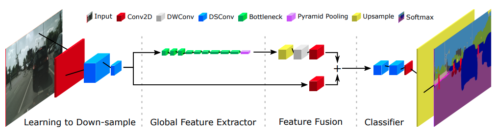
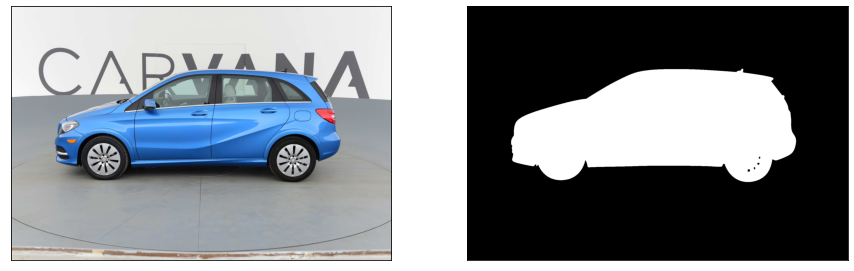

# fast-scnn
[Fast-SCNN](https://arxiv.org/abs/1902.04502) implementation in tensorflow2\

## Dataset
The dataset is a collection of car images taken from different angles and corresponding foreground masks, obtained from the [Carvana Kaggle competition](https://www.kaggle.com/c/carvana-image-masking-challenge). The task is to perform semantic segmentation and create a binary mask for foreground pixels.\

If one wants to run the notebook, download the images to a local folder, and change the paths in the notebook accordingly. I highly recommend storing the images on Google Drive, and then mount Google Drive in the notebook.
